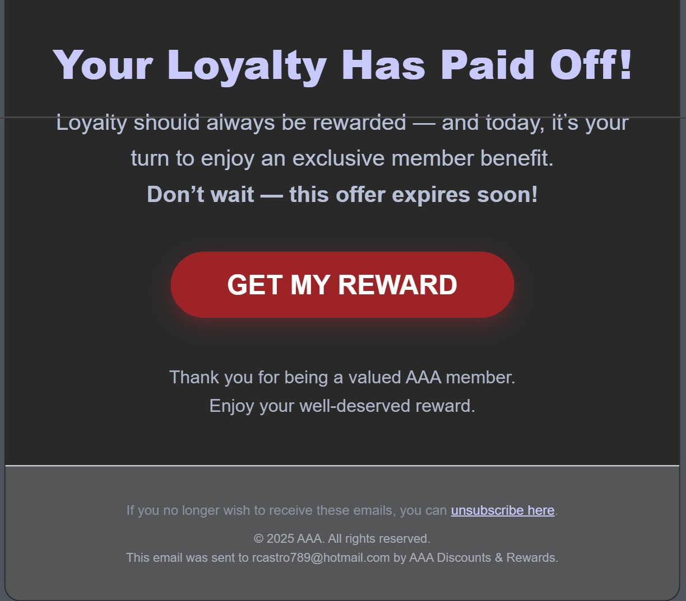

# Technical Threat Intelligence Report: "AAA Reward" Phishing Campaign

**Date of Analysis:** January 28, 2026
**Analyst:** Roy Castro
**Threat Level:** 🔴 High (Financial Fraud & Credential Harvesting)

---

## 1. Executive Summary
This report analyzes a phishing campaign impersonating **AAA (American Automobile Association)**. The attack utilizes a "Loyalty Reward" lure, offering an exclusive benefit to members. Technical analysis reveals the use of a compromised or malicious Microsoft tenant for delivery and the exploitation of raw IP addresses for the malicious landing pages, masked by Microsoft SafeLinks.

## 2. Attack Lifecycle (Kill Chain)
* **Initial Vector:** Email delivery via an obfuscated sender address (`mll@AAAqhxzh.com`) through a Microsoft infrastructure relay.
* **Lure:** "Your Loyalty Has Paid Off!" — Social engineering based on reward-seeking behavior and seasonal urgency.
* **Trust Layer:** Use of legitimate AAA branding, high-quality product imagery, and Microsoft SafeLinks protection.
* **Payload:** Malicious buttons linking to a direct IP address (`81.171.12.132`) designed to capture sensitive user information.
* **Objective:** Exfiltration of personal data and potentially financial details under the guise of a "member benefit" claim.

## 3. Technical Indicators of Compromise (IoCs)

| Indicator Type | Value | Note |
| :--- | :--- | :--- |
| **Sender IP** | `185.17.146.229` | Originating server in Germany (DE); failed SPF/DKIM validation. |
| **Display Name** | `AAA Discounts & Rewards` | Impersonation of a legitimate loyalty program. |
| **From Address** | `mll@AAAqhxzh.com` | Suspicious domain mimicking AAA; failed authentication check. |
| **Return-Path** | `09sii@ant20562425.onmicrosoft.com` | Real origin address from a suspicious Microsoft tenant. |
| **Phishing URL** | `hxxp://81[.]171[.]12[.]132/4zRAwP...` | Direct IP destination for the "Reward" portal. |
| **Subject Line** | `Your Loyalty Comes With a Reward | No. AOV-008204` | Uses a fake reference number for legitimacy. |

## 4. Visual Evidence

## 5. Evasion Techniques & Technical Analysis

1. **Brand Impersonation:**
   The email uses the official AAA logo and professional photography of a roadside kit to build immediate trust.

2. **SPF/DKIM Failure (Spoofing):**
   The headers indicate an **`spf=fail`**. El servidor en `185.17.146.229` no está autorizado para enviar correos de `aaaqhxzh.com`.

3. **SafeLinks & IP Infrastructure:**
   Se utiliza **Microsoft SafeLinks** para envolver la URL maliciosa, ocultando que el destino final es una IP directa (`81.171.12.132`).

4. **SCL Rating:**
   El encabezado **`X-MS-Exchange-Organization-SCL: 8`** confirma que el filtro de Microsoft detectó el correo como spam/phishing de alta confianza.

---

*Report generated for Cybersecurity Portfolio purposes (CEH v13 Study Track).*
