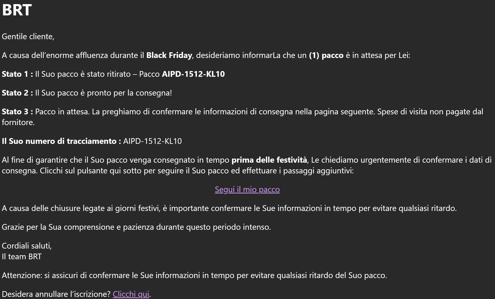

# Technical Threat Intelligence Report: "BRT Delivery" Phishing Campaign

**Date of Analysis:** January 21, 2026
**Analyst:** Roy Castro
**Threat Level:** 🔴 High (Financial Fraud & Credential Harvesting)

---

## 1. Executive Summary
This report analyzes a phishing campaign targeting Italian users by impersonating **BRT (Bartolini)**, a major logistics courier. Similar to Case #04, the threat actor leverages **Google Cloud Storage** to host the malicious infrastructure. The attack utilizes a "Black Friday/Holiday" lure to create urgency and directs victims to a fraudulent tracking page designed to steal personal and financial information.

## 2. Attack Lifecycle (Kill Chain)
* **Initial Vector:** Email delivery via a suspicious domain (`.ca`) utilizing a "Noreply" alias.
* **Lure:** "Package waiting" notification citing "Black Friday" delays and a pending status.
* **Trust Layer:** Legitimate Google Cloud Storage (`storage.googleapis.com`) used to bypass URL filters.
* **Payload:** A static HTML page hosted in a public bucket (`locismodbuck1`) that renders a fake courier portal.
* **Objective:** Exfiltration of user credentials or credit card details for a small "redelivery fee."

## 3. Technical Indicators of Compromise (IoCs)

| Indicator Type | Value | Note |
| :--- | :--- | :--- |
| **Sender Address** | `Noreply-zagZTnoj@zagztnojzagztnoj.ca` | Highly suspicious, repetitive random string domain. |
| **Sender Domain** | `zagztnojzagztnoj.ca` | TLD (.ca) mismatch for an Italian service (BRT). |
| **Phishing URL** | `hxxps://storage[.]googleapis[.]com/locismodbuck1/hreflyism.html` | Malicious file hosted on legitimate Google infrastructure. |
| **URL Parameters** | `#?Z289MSZzMT0yMjIzNDUy...` | Encoded fragment identifier likely used to track the specific victim ID. |
| **Subject Line** | `Il tuo pacco è pronto per la consegna! Conferma le informazioni...` | Uses standard logistics phrasing to lower suspicion. |

## 4. Visual Evidence

## 5. Evasion Techniques & Technical Analysis

1.  **PaaS Abuse (Recurrent Technique):**
    The attacker continues to exploit **Google Cloud Storage** (`storage.googleapis.com`). Specifically, the bucket named `locismodbuck1` is hosting the file `hreflyism.html`. This technique ("Living off the Land") allows the malicious link to inherit Google's high domain reputation, effectively bypassing standard email security filters.

2.  **Fragment Identifier Tracking:**
    The URL contains a long fragment identifier after the hash (`#?Z289...`). This is a technique used to pass parameters to the malicious JavaScript on the landing page without sending them to the server in a way that is easily logged by intermediate proxies. It likely contains the victim's encoded email address to auto-fill the fraudulent form.

3.  **Typosquatting/Random Domain Generation:**
    Unlike Case #04 which used a relay, this email originates from `zagztnojzagztnoj.ca`. The repetition of strings ("zagztnoj") and the use of a Canadian TLD (`.ca`) for an Italian courier are clear indicators of a burner domain generated algorithmically or registered cheaply for a short-lived campaign.

4.  **Social Engineering (Seasonal Urgency):**
    The email explicitly references "Black Friday" and "Holiday closures". By blaming the delay on high traffic and warning that the package must be confirmed "before the holidays," the attacker creates a plausible pretext for the delay and a deadline to force immediate action.

---

*Report generated for Cybersecurity Portfolio purposes.*
