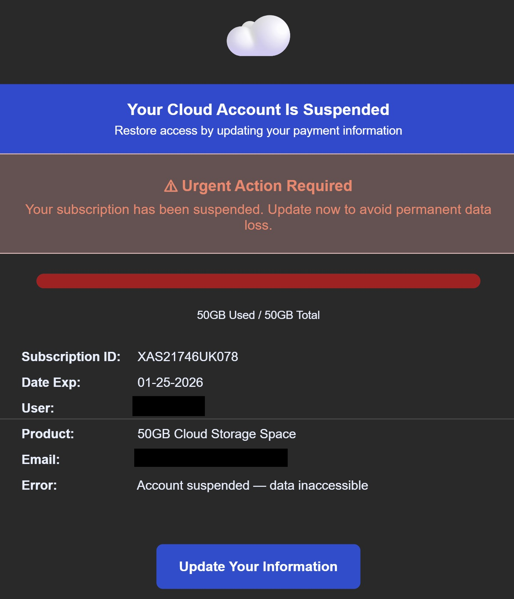

# Technical Threat Intelligence Report: "Cloud Storage" Phishing Campaign

**Date of Analysis:** January 28, 2026
**Analyst:** Roy Castro
**Threat Level:** 🔴 High (Credential Harvesting & Financial Fraud)

---

## 1. Executive Summary
This report analyzes a phishing campaign impersonating a generic "Cloud Storage" service provider to exfiltrate financial information. The threat actor utilizes a "Storage Full" lure to create a sense of urgency and leverages **Microsoft SafeLinks** to mask a direct IP destination, attempting to bypass domain-based security filters.

## 2. Attack Lifecycle (Kill Chain)
* **Initial Vector:** Email delivery originating from a Dutch IP address (`95.211.43.50`) with failed SPF/DKIM authentication.
* **Lure:** "Urgent Action Required" notification claiming 100% storage capacity reached (50GB/50GB) and account suspension.
* **Trust Layer:** Use of professional HTML templates and Microsoft's SafeLinks infrastructure to appear legitimate to the end-user.
* **Payload:** A fraudulent "Update Information" portal hosted on a raw IP address (`64.120.94.224`).
* **Objective:** Direct theft of credit card details and PII for financial fraud.

## 3. Technical Indicators of Compromise (IoCs)

| Indicator Type | Value | Note |
| :--- | :--- | :--- |
| **Sender IP** | `95.211.43.50` | Server located in the Netherlands; critical `spf=fail`. |
| **From Address** | `hello@CloudStoragecb0.org` | Spoofed domain with no valid security signatures. |
| **Return-Path** | `3fqrzehyt6@dus19794839.onmicrosoft.com` | Real origin indicating a burner Microsoft tenant. |
| **Phishing URL** | `hxxp://64[.]120[.]94[.]224/4oyNcd8...` | Target IP hidden behind a SafeLinks redirect. |
| **Subject Line** | `🚫 Your Cloud Account Is Suspended — Resolve to Avoid Termination...` | High-pressure subject line using emojis to trigger action. |

## 4. Visual Evidence

## 5. Evasion Techniques & Technical Analysis

1.  **Authentication Failure & Spoofing:**
    The email headers reveal a critical **`spf=fail`**. The sending server is not authorized to send mail for the domain `cloudstoragecb0.org`, confirming a direct spoofing attempt.

2.  **SafeLinks Wrapper & IP Obfuscation:**
    The attacker leverages Microsoft's SafeLinks feature to mask the destination. The URL uses a user-prefix technique (`j6w7e.com@64.120.94.224`) to deceive users and automated scanners into believing the link leads to a `.com` domain rather than a raw IP address.

3.  **Psychological Triggers (Loss Aversion):**
    The email explicitly mentions "permanent data loss" and displays a full progress bar. This tactic is designed to induce fear and force the victim to act quickly before checking the sender's authenticity.

4.  **Recipient Fingerprinting:**
    The presence of a massive `data` parameter in the SafeLinks URL indicates that the attacker is tracking which specific recipient clicked the link, allowing them to confirm active targets for future campaigns.

---

*Report generated for Cybersecurity Portfolio purposes.*
