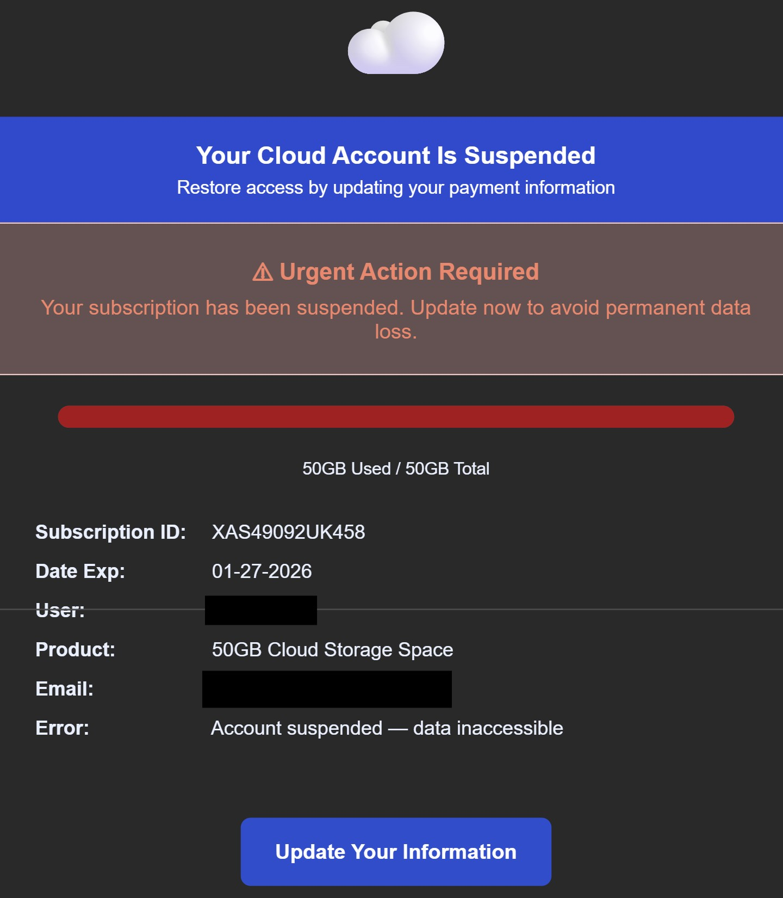

# Technical Threat Intelligence Report: "Cloud Storage" Phishing Campaign (Variation B)

**Date of Analysis:** January 28, 2026
**Analyst:** Roy Castro
**Threat Level:** 🔴 High (Credential Harvesting & Financial Fraud)

---

## 1. Executive Summary
This report analyzes a variation of the "Cloud Storage" phishing campaign. While the visual lure remains identical to previous cases (Subscription suspension/data loss), the technical infrastructure has shifted. The threat actor is now utilizing the same SMTP relay and malicious IP destination observed in the AAA and Starbucks campaigns, indicating a consolidated multi-brand attack operation.

## 2. Attack Lifecycle (Kill Chain)
* **Initial Vector:** Email delivery via a malicious Microsoft tenant relay (`ant20562425.onmicrosoft.com`).
* **Lure:** "Urgent Action Required" — Claims of account suspension and 50GB storage limit reached to induce panic.
* **Trust Layer:** Use of Microsoft SafeLinks to wrap the payload, appearing as a protected Outlook link.
* **Payload:** Malicious redirect to a raw IP destination (`81.171.12.132`) for credential and payment exfiltration.
* **Objective:** Direct theft of personal identity information (PII) and financial data.

## 3. Technical Indicators of Compromise (IoCs)

| Indicator Type | Value | Note |
| :--- | :--- | :--- |
| **Sender IP** | `185.17.146.229` | German IP used across AAA, Starbucks, and Cloud campaigns. |
| **Return-Path** | `dszns@ant20562425.onmicrosoft.com` | Shared infrastructure tenant for this threat cluster. |
| **From Address** | `hello@CloudStorage9ig.com` | New typosquatted domain variation. |
| **Phishing URL** | `hxxp://81[.]171[.]12[.]132/4roWyJ...` | Malicious IP used for hosting the fraudulent portal. |
| **Subject Line** | `🔒 Your Cloud Account Is Suspended — Verification Required...` | Updated subject line with added lock emoji for false security. |

## 4. Visual Evidence

## 5. Evasion Techniques & Technical Analysis

1. **Infrastructure Consolidation:**
   The most significant finding is the pivot to IP `81.171.12.132` and `185.17.146.229`. This confirms that the same threat group is simultaneously running impersonation campaigns for Cloud Storage, AAA, and Starbucks.

2. **SPF/DKIM Failure:**
   The headers continue to show an **`spf=fail`**. The unauthorized sender is attempting to bypass security by using a legitimate Microsoft relay to deliver spoofed mail.

3. **SafeLinks Exploitation:**
   By using SafeLinks, the attacker ensures the actual malicious IP is not visible in the message body, increasing the likelihood of a user clicking the link.

4. **SCL Rating:**
   The message received an **`SCL: 8`**, marking it as high-confidence phishing by Microsoft's internal filters.

---

*Report generated for Cybersecurity Portfolio purposes (CEH v13 Study Track).*
