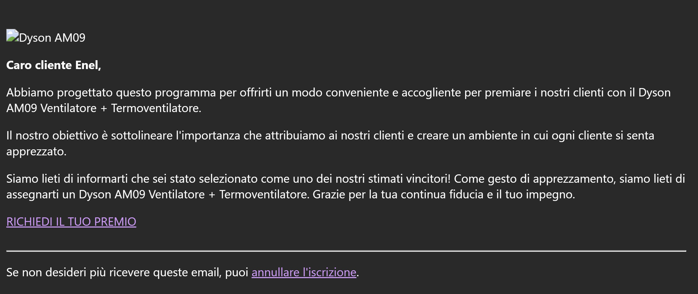

# Technical Threat Intelligence Report: "Enel/Dyson Reward" Phishing Campaign

**Date of Analysis:** January 21, 2026
**Analyst:** Roy Castro
**Threat Level:** 🔴 High (Identity Theft & Financial Fraud)

---

## 1. Executive Summary
This report analyzes a "Reward-based" phishing campaign targeting Italian users, impersonating **Enel** (a multinational energy company). Unlike previous cases involving urgency or fear, this campaign utilizes positive reinforcement ("You won a Dyson fan") to lure victims. The technical infrastructure relies on **Google Cloud Storage** abuse to host the malicious landing page, continuing a pattern observed in Cases #04 and #05.

## 2. Attack Lifecycle (Kill Chain)
* **Initial Vector:** Email delivery via a suspicious domain (`atquv.us`).
* **Lure:** "Customer Appreciation" reward claiming the user has won a Dyson AM09.
* **Trust Layer:** Use of **Enel** branding and legitimate **Google Cloud** URLs to evade detection.
* **Payload:** A static HTML page hosted in a public bucket (`25kdhsale`) that mimics a prize claim portal.
* **Objective:** Theft of Personal Identifiable Information (PII) and credit card details (ostensibly for "shipping costs").

## 3. Technical Indicators of Compromise (IoCs)

| Indicator Type | Value | Note |
| :--- | :--- | :--- |
| **Sender Address** | `yqZyBetk@atquv.us` | Randomized local part and cheap/suspicious TLD (.us). |
| **Phishing URL** | `hxxps://storage[.]googleapis[.]com/25kdhsale/NWBH25.html` | Malicious file hosted on legitimate Google infrastructure. |
| **URL Parameters** | `#?Z289MSZzMT0y...` | Encoded fragment identifier used to track victim sessions or auto-fill forms. |
| **Subject Line** | `sirnikdpc, Verifica l’ordine del tuo Dyson AM09 Portable Fan...` | Personalization (using the email handle) to increase click-through rate. |
| **Abused SaaS** | Google Cloud Storage (Bucket: `25kdhsale`) |

## 4. Visual Evidence

## 5. Evasion Techniques & Technical Analysis

1.  **PaaS Abuse (Persistent Threat Pattern):**
    The attacker leverages **Google Cloud Storage** (`storage.googleapis.com`) to host the file `NWBH25.html`. Security filters often hesitate to block the entire `googleapis.com` domain due to its widespread legitimate use. This campaign uses a different bucket (`25kdhsale`) compared to the BRT case (`locismodbuck1`), suggesting the attacker rotates buckets to avoid takedowns.

2.  **Psychological Manipulation (Reward vs. Fear):**
    While Cases #04 (iCloud) and #05 (BRT) exploited "Loss Aversion" (fear of losing data/packages), this campaign exploits **"Greed/Reward" psychology**. By offering a high-value item (Dyson AM09) for free, the attacker lowers the victim's skepticism. The email emphasizes "customer appreciation" to build a false sense of rapport.

3.  **Randomized Sender Infrastructure:**
    The sender domain `atquv.us` appears to be an algorithmically generated or cheap disposable domain. The headers indicate the email may have been relayed or spoofed to pass basic checks, but the visual mismatch between the sender domain and the brand (Enel) is a key indicator of compromise.

4.  **Fragment Identifier Obfuscation:**
    Similar to the BRT case, the URL uses a fragment identifier (`#`) followed by a long base64-like string (`?Z289...`). This technique prevents the parameters (which likely identify the victim) from being sent to the web server logs in the initial request, keeping the victim tracking logic client-side (JavaScript).

---

*Report generated for Cybersecurity Portfolio purposes.*
