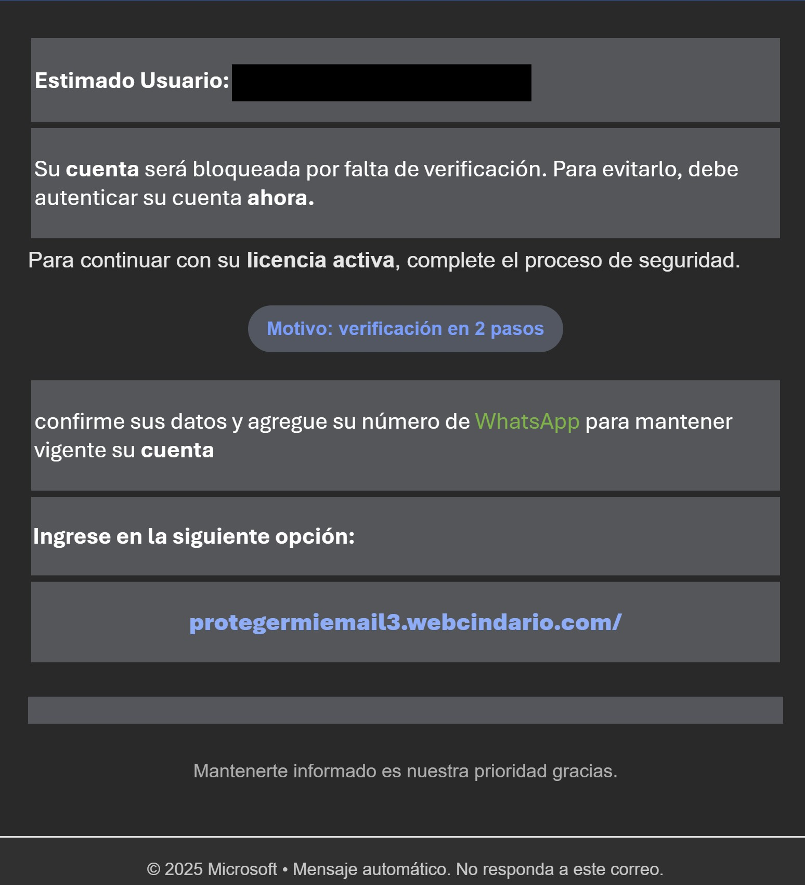

# Technical Threat Intelligence Report: Microsoft Outlook "2FA Verification" Phishing

**Date of Analysis:** January 20, 2026
**Analyst:** Roy Castro
**Threat Level:** 🔴 High (Credential Harvesting / Account Takeover)
**Campaign Status:** Active

---

## 1. Executive Summary
This report documents a credential harvesting campaign targeting Microsoft Outlook users. The Threat Actor (TA) utilizes **Compromised Academic Accounts** (University of Uberlândia, Brazil) to distribute phishing emails, bypassing standard SPF/DKIM filters. The campaign leverages **Free Hosting Infrastructure** (`webcindario.com`) to host a fraudulent landing page mimicking the Microsoft 2FA login portal.

## 2. Attack Lifecycle (Kill Chain)
* **Initial Vector:** Phishing email sent from a compromised legitimate educational account (`@ufu.br`).
* **Lure:** False security alert stating "Su cuenta será bloqueada" (Your account will be blocked) due to missing 2-step verification.
* **Trust Layer:** Usage of valid SPF/DKIM signatures from the compromised university domain to bypass "Spam" folders.
* **Payload URL:** `hxxps://protegermiemail3.webcindario[.]com/`
* **Objective:** Exfiltration of Microsoft user credentials and Personal Phone Numbers (WhatsApp).

## 3. Technical Indicators of Compromise (IoCs)

| Indicator Type | Value | Context |
| :--- | :--- | :--- |
| **Sender Address (From)** | `gustavo-barbosa@ufu.br` | Compromised Account (Univ. Federal de Uberlândia). |
| **Sender Display Name** | `Protege ahora!` | Social Engineering tactic. |
| **Phishing Domain** | `protegermiemail3.webcindario[.]com` | Free hosting subdomain (Miarroba). |
| **Subject Line** | `Procederemos la Verificacion` | Urgency / Authority. |
| **Hosting Provider** | Miarroba Networks (Spain) | Infrastructure abuse. |

## 4. Visual Evidence

**Figure 1: Full Phishing Email Artifact**
The capture below illustrates the complete social engineering flow:
1.  **Impersonation:** Uses the official Outlook color scheme (#0072C6).
2.  **Fear Appeal:** Warns of imminent account blockage.
3.  **Anomalous Request:** Explicitly asks to link a **WhatsApp** number, a non-standard procedure for Microsoft enterprise security.
4.  **Malicious Link:** Redirects to a low-reputation free hosting subdomain.

## 5. Evasion Techniques & Technical Analysis

### A. Compromised Academic Infrastructure (Sender Identity)
The email headers reveal the message originated from a valid university server in Brazil:

From: Protege ahora! <gustavo-barbosa@ufu.br>

By hijacking a legitimate .br academic account, the attacker inherits the domain's reputation. Security filters often whitelist educational domains, allowing the phishing email to land directly in the victim's "Focused" Inbox rather than "Junk".

### B. Cross-Platform Social Engineering (WhatsApp Lure)
Unusually for a Microsoft-themed phish, the text requests the user to "add their WhatsApp number" ("agregue su número de WhatsApp"). This is a high-confidence indicator of phishing, as Microsoft does not use WhatsApp for enterprise identity verification. This suggests the attacker aims to harvest phone numbers for secondary attacks (Smishing) or account hijacking.

### C. Free Subdomain Abuse
The attacker utilizes webcindario.com, a free hosting service provided by Miarroba.

URL: protegermiemail3.webcindario.com

Technique: Subdomain generation. The prefix protegermiemail3 (protectmyemail3) is designed to look like a security tool. Using free hosting allows the attacker to spin up new sites immediately if the current one is taken down (Takedown Evasion).

### D. HTML Obfuscation
The email body uses standard HTML table structures with CSS styling that mimics official Microsoft notifications (font family Aptos, sans-serif and specific hex colors like rgb(0, 114, 198)). The ominous warning "Su cuenta será bloqueada" creates a sense of urgency (Fear Appeal) to force a click without inspection.

Report generated for Cybersecurity Portfolio purposes. Analysis performed on a forwarded sample; original network headers were reconstructed from the message body artifacts.
