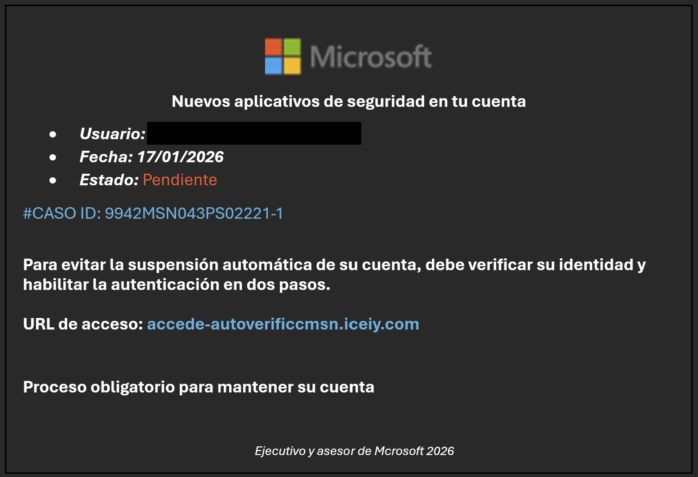

# Technical Threat Intelligence Report: Microsoft "Account Suspension" Campaign

**Date of Analysis:** January 20, 2026
**Analyst:** Roy Castro
**Threat Level:** 🔴 High (Account Takeover / Identity Theft)
**Campaign Status:** Active

---

## 1. Executive Summary
This report analyzes a phishing campaign targeting Microsoft credentials aimed at Latin American users. The Threat Actor (TA) leverages **Compromised Educational Infrastructure** (Universidad Indoamérica, Ecuador) to bypass email filters. The attack utilizes **Dynamic DNS (DDNS)** abuse via `iceiy.com` to host the malicious payload, employing high-pressure social engineering tactics ("Automatic Suspension").

## 2. Attack Lifecycle (Kill Chain)
* **Initial Vector:** Email sent from a valid, compromised academic account (`@indoamerica.edu.ec`).
* **Lure:** "Llamado de atencion" (Attention Call) threatening immediate account suspension.
* **Trust Layer:** Abuse of legitimate university domain reputation (SPF/DKIM pass).
* **Payload URL:** `hxxp://accede-autoverificcmsn.iceiy[.]com`
* **Objective:** Credential harvesting (Microsoft Login).

## 3. Technical Indicators of Compromise (IoCs)

| Indicator Type | Value | Context |
| :--- | :--- | :--- |
| **Sender Address** | `jenriquez7@indoamerica.edu.ec` | Compromised Account (Univ. Indoamérica, Ecuador). |
| **Sender Name** | `JENIFFER ANABEL ENRRIQUEZ ESCOBAR` | Likely the identity of the compromised student/staff. |
| **Phishing URL** | `accede-autoverificcmsn.iceiy[.]com` | Dynamic DNS Abuse (Subdomain Typosquatting). |
| **Subject Line** | `Llamado de atencion` | Fear Appeal / Intimidation. |
| **Fake Case ID** | `9942MSN043PS02221-1` | Used to feign legitimacy. |

## 4. Visual Evidence

**Figure 1: The Lure**
The email presents a fake "Security Case" with an imminent threat of suspension. Note the typo in the signature ("Mcrosoft") which indicates a lack of quality control in the phishing kit.

## 5. Technical Analysis & Evasion Techniques

### A. Academic Domain Compromise (LATAM Region)
Similar to recent campaigns originating from Brazil (`ufu.br`), this attack leverages a compromised account from **Ecuador** (`indoamerica.edu.ec`).
* **Tactical Advantage:** Educational domains (`.edu`) typically possess high domain authority and are often whitelisted by enterprise spam filters, ensuring delivery to the Inbox.

### B. Dynamic DNS Abuse (Iceiy.com)
The attacker utilizes a Dynamic DNS provider (`iceiy.com`) to generate the malicious link.
* **URL Structure:** `accede-autoverificcmsn.iceiy.com`
* **Technique:** The subdomain `accede-autoverificcmsn` combines keywords ("access", "auto-verify", "msn") to trick users into believing it is a legitimate Microsoft subdomain. DDNS allows the attacker to rapidly point this domain to different malicious IPs if one gets blocked. 

### C. Psychological Intimidation (Fear Appeal)
The subject line "Llamado de atencion" (Attention Call/Warning) is aggressive and typically associated with HR or disciplinary actions. This is designed to induce panic, bypassing the victim's critical thinking.

---

*Report generated for Cybersecurity Portfolio purposes. Analysis based on email artifacts recovered from a forwarded sample.*
