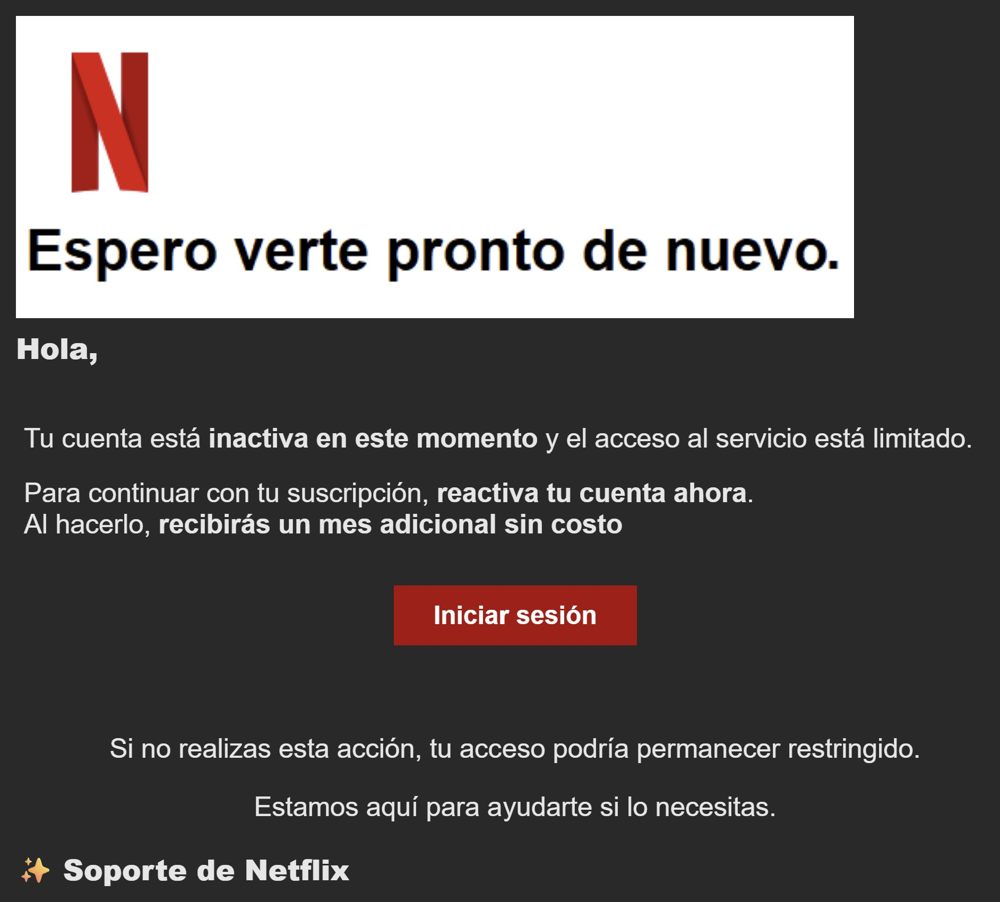

# Technical Threat Intelligence Report: Netflix "Reactivation" Phishing Campaign

**Date of Analysis:** January 20, 2026
**Analyst:** Roy Castro
**Threat Level:** 🔴 High (Credential Harvesting / Payment Fraud)
**Campaign Status:** Active

---

## 1. Executive Summary
This report documents a phishing campaign targeting Netflix subscribers using a "Service Inactivity" lure. The threat actor (TA) leverages a **Compromised Hospitality Account** (SANA Hotels, Portugal) to bypass email reputation filters. The attack directs victims to a compromised small business website in Guatemala (`cuilapavision.com`) hosting the credential harvesting kit.

## 2. Attack Lifecycle (Kill Chain)
* **Initial Vector:** Phishing email sent from a valid corporate account (`@sanahotels.com`).
* **Lure:** "Tu cuenta está inactiva" (Your account is inactive) combined with a "Free Month" incentive.
* **Trust Layer:** Usage of a legitimate hotel chain's domain (SANA Hotels) to pass SPF/DKIM checks.
* **Payload URL:** `hxxps://cuilapavision[.]com/clo/`
* **Objective:** Theft of Netflix credentials and Payment Information.

## 3. Technical Indicators of Compromise (IoCs)

| Indicator Type | Value | Context |
| :--- | :--- | :--- |
| **Sender Address** | `mdmsudlisboa1@sanahotels.com` | Compromised Account (SANA Hotels, Portugal). |
| **Sender Name** | `Estado de tu membresíawe` | Typo ("we") indicates automated script error. |
| **Phishing Domain** | `cuilapavision[.]com` | Compromised CMS (Guatemala). |
| **Phishing Path** | `/clo/` | Likely stands for "Clone" or "Cloud". |
| **Subject Line** | `Nos encantaría darle la bienvenida de nuevo` | Reactivation/Welcome Back lure. |

## 4. Visual Evidence

**Figure 1: The Lure**
The email utilizes official Netflix branding assets. The call-to-action uses **Positive Reinforcement** ("recibirás un mes adicional sin costo") to encourage clicks. Note the visual consistency with legitimate notifications.

## 5. Technical Analysis & Evasion Techniques

### A. Corporate Domain Hijacking (Hospitality Sector)
The attacker compromised an account belonging to **SANA Hotels** (`sanahotels.com`).
* **Account Analysis:** The handle `mdmsudlisboa1` suggests a technical service account (possibly "Mobile Device Management - SUD Lisboa"). Hijacking service accounts is highly effective as they often have high sending limits and are less monitored than human employee accounts.

### B. Compromised Content Management System (CMS)
The landing page is hosted on `cuilapavision.com`, a legitimate domain belonging to an optical clinic in **Cuilapa, Guatemala**.
* **Technique:** The attacker likely exploited a vulnerability in the site's CMS (e.g., WordPress) to upload the phishing kit into a subfolder (`/clo/`). This allows the attack to piggyback on the site's existing SSL certificate and positive domain reputation.

### C. Incentive-Based Social Engineering
Unlike "Account Suspension" attacks that rely on fear, this campaign uses **Incentivization** (Greed/Reward).
* **Psychology:** Promising a "free month" lowers the victim's suspicion, targeting users who may have dormant accounts or are sensitive to price.

### D. Tradecraft Errors
The sender name `Estado de tu membresíawe` contains a distinct typo ("we" suffix). This suggests the attacker used a mail-merge script where a variable was improperly concatenated, revealing a lack of quality control in the phishing toolkit distribution.

---

*Report generated for Cybersecurity Portfolio purposes. Analysis performed on a forwarded sample; original network headers were reconstructed from the message body artifacts.*
